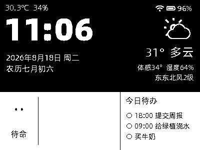
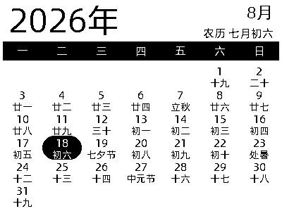
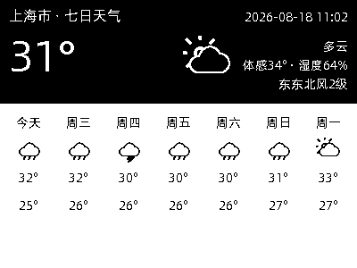
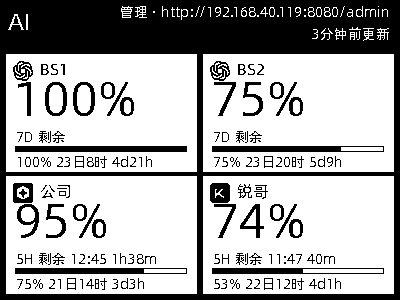
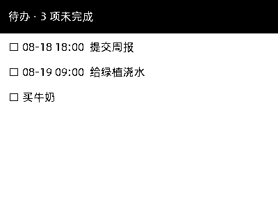
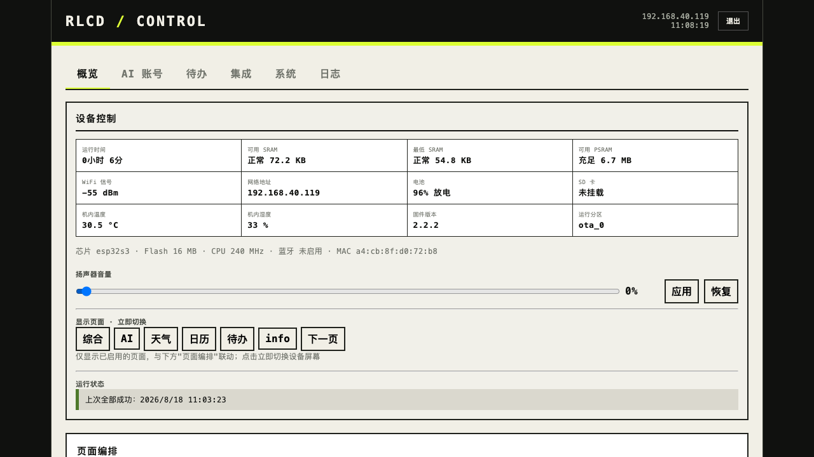
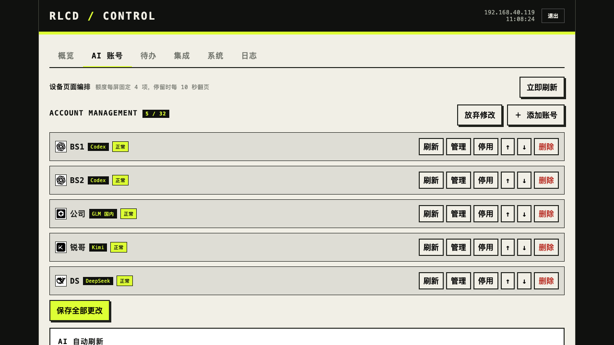

# Waveshare ESP32-S3-RLCD-4.2 桌面信息屏固件

基于小智 AI 语音助手固件（[78/xiaozhi-esp32](https://github.com/78/xiaozhi-esp32)）深度定制的个人 fork，把 **Waveshare ESP32-S3-RLCD-4.2** 从语音助手扩展为一台**常驻桌面的低功耗单色信息屏**。

- 400×300 1-bit 反射式 LCD，阳光下可读，静态显示几乎不耗电
- 五个信息页：综合 / 日历 / 七日天气 / AI 额度 / 待办
- 保留完整小智语音对话能力（流式 ASR + LLM + TTS）
- AI 服务额度监控仪表盘（Codex / Kimi / GLM / DeepSeek 等）
- 局域网 HTTP 后台配置一切，不依赖公网

> 本仓库只有 `main/boards/waveshare-s3-rlcd-4.2/` 是活跃开发的生产板，其余 119 个板目录为上游继承，未做适配。
> 上游原版 README（英语/日语/中文）已移除，上游项目资料请直接访问 [78/xiaozhi-esp32](https://github.com/78/xiaozhi-esp32)。

---

## 功能速览

| 模块 | 说明 |
|---|---|
| **综合页** | 大时钟、公历/农历日期、当前天气、室内温湿度、小智状态与表情、未完成待办、Wi-Fi/电池 |
| **日历页** | 月历、农历日、二十四节气、法定节假日（休）与调休上班（班）标记 |
| **七日天气页** | 当前天气 + 七日预报（高德实时 + Open-Meteo），断网保留最后快照 |
| **AI 额度页** | 最多 32 个账号卡片，5H/周额度分层显示、进度条、重置倒计时、失败重试与警告标 |
| **待办页** | 待办清单常驻显示，支持后台/REST API/语音三种维护方式 |
| **小智语音** | 唤醒词、语音对话、MCP 工具（系统信息、切页、配网、备忘提醒） |
| **局域网后台** | `http://<设备IP>:8080/admin`，账号/页面/天气/日历/待办/Wi-Fi/音量/截屏全配置 |
| **自动化接口** | 待办 REST API + 独立 Bearer Token，适配 Home Assistant / 快捷指令 / curl |

详细功能说明见 **[docs/功能文档.md](docs/功能文档.md)**。

## 界面预览

### 设备屏幕（400×300 1-bit RLCD，设备实拍截图）

| 综合页 | 日历页 | 七日天气页 |
|:---:|:---:|:---:|
|  |  |  |
| **AI 额度页** | **待办页** | |
|  |  | |

### 局域网后台（`http://<设备IP>:8080/admin`）

| 概览（设备控制 / 音量 / 切页 / 运行状态） | AI 账号（额度账号管理） |
|:---:|:---:|
|  |  |

> 截图通过设备自带的 `/api/display/screenshot` 接口与浏览器实采，所见即真机当前界面。

## 硬件

| 项 | 值 |
|---|---|
| 开发板 | Waveshare ESP32-S3-RLCD-4.2 |
| 芯片 | ESP32-S3-WROOM-1-N16R8（16 MB Flash / 8 MB PSRAM） |
| 屏幕 | 400×300 1-bit 反射式单色 LCD，SPI 40 MHz |
| 传感器 | SHTC3 温湿度、PCF85063 RTC（断电保持时间） |
| 音频 | ES8311 解码 + ES7210 麦克风 + MAX98357A 功放 |
| 其他 | 锂电池接口（ADC 电量检测）、BOOT/USER 双按键、SD 卡槽 |

板级细节见 [main/boards/waveshare-s3-rlcd-4.2/README.md](main/boards/waveshare-s3-rlcd-4.2/README.md)。

## 快速开始

### 环境

- ESP-IDF **v5.5.2**（`idf_component.yml` 要求 `>=5.5.2`）
- Python 3.8+、CMake + Ninja

### 编译

```bash
# 加载 ESP-IDF 环境（路径按实际安装位置修改）
. /path/to/esp-idf-v5.5.2/export.sh

cd xiaozhi-esp32
idf.py set-target esp32s3
idf.py menuconfig
# 确认：
#   Board Type 选择 Waveshare ESP32-S3-RLCD-4.2
#   分区表为 partitions/v2/16m_rlcd_quota.csv（16 MB 自定义表）

idf.py build
```

### 烧录

```bash
ls /dev/cu.usbmodem*        # 确认串口
idf.py -p /dev/cu.usbmodemXXXX flash monitor
```

> **注意**：本板使用自定义分区表（新增 256 KB `quota_nvs` 分区），**更换分区表后必须完整烧录，不能只 OTA**。完整烧录布局与验收标准见[项目手册 §9](docs/waveshare-s3-rlcd-4.2-project-handbook.md)。

烧录后串口观察至少 60 秒，关注 `abort` / `reboot` / `ESP_ERR_NO_MEM` / `minimal sram`。

## 使用

### 局域网后台

浏览器打开 `http://<设备IP>:8080/admin`：

1. 首次访问设置管理员密码（8–72 位）；
2. 配置页面顺序、AI 额度账号、天气城市（高德 Key）、节假日源、待办、Wi-Fi；
3. 所有密钥只写不回显；写操作走 Cookie + CSRF，自动化走 Bearer Token。

### 按键

| 按键 | 操作 | 功能 |
|---|---|---|
| BOOT | 单击（启动阶段） | 进入配网 |
| BOOT | 单击（综合页） | 开始/停止小智对话 |
| BOOT | 单击（AI 额度页） | 立即刷新账号额度 |
| BOOT | 单击（七日天气页） | 立即刷新天气 |
| USER | 单击 | 按配置顺序切页（AI 多子页时先翻子页） |
| USER | 双击 | 刷新全部数据（天气/时间/传感器） |
| USER | 长按 | 滚动显示系统信息（CPU/内存/电池/Wi-Fi） |

连续 5 分钟无操作进入省电模式（UI 刷新 1s → 5s），任意按键唤醒。

## 文档导航

| 文档 | 内容 |
|---|---|
| [docs/功能文档.md](docs/功能文档.md) | **完整功能说明**（页面/后台/API/数据源/安全） |
| [docs/waveshare-s3-rlcd-4.2-project-handbook.md](docs/waveshare-s3-rlcd-4.2-project-handbook.md) | 项目手册：烧录验收、故障排查、维护建议 |
| [ARCHITECTURE.md](ARCHITECTURE.md) | 系统架构、启动顺序、数据流、设计决策与不变量 |
| [PROJECT_CONTEXT.md](PROJECT_CONTEXT.md) | 权威上下文（模块清单、NVS、开发状态） |
| [AGENTS.md](AGENTS.md) | AI 协作工作规范（修改代码前必读） |
| [DEVELOPMENT_LOG.md](DEVELOPMENT_LOG.md) | 开发日志（倒序） |
| [docs/code_style.md](docs/code_style.md) | 代码风格（clang-format，Google 基础） |

## 与上游的关系

本项目 fork 自 [78/xiaozhi-esp32](https://github.com/78/xiaozhi-esp32)（小智 AI 语音助手，MIT 许可），保留了上游的语音框架、协议栈（WebSocket / MQTT+UDP）、MCP 工具系统和 OTA 能力，在此之上新增了板级显示页、业务管理器与局域网后台。上游通用层原则上不改动，扩展全部集中在 `main/boards/waveshare-s3-rlcd-4.2/`。

## 许可证

遵循上游项目的 [MIT License](LICENSE)。个人项目，仅供学习交流；内置的第三方服务接口（高德、Open-Meteo、holiday-cn、各 AI 厂商）受其各自条款约束。
